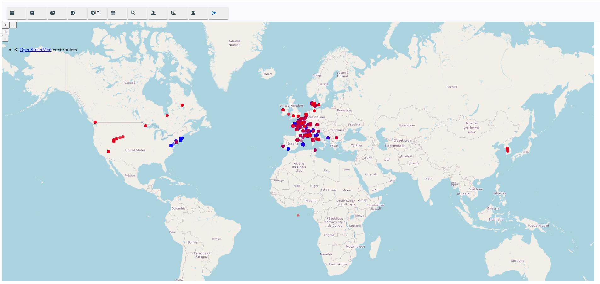
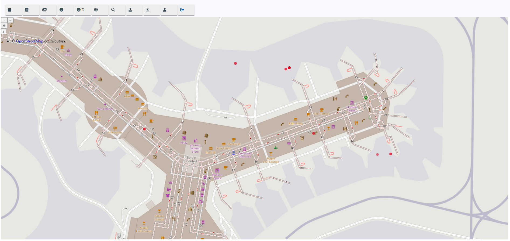

# PhotoAndVideoAnalysis
PhotoAndVideoAnalysis is a system to store and analyze images and video files, the goal is to extract as much information as possible from the images using exif data, image recognition techniques and to provide a web interface to easily use the information extrated to retrieve photo, create albums, etc...

This project is develop for learning purpose, and is shared with no garantee expressed or implied.

Main technologies used are :
1. docker
2. nginx: unify the multiple servers behing one address)
3. ssl: for https access (you can use the provided ssl_generation docker container to generate your own slef signed certificate)
4. databases: postgres for file informations, mongodb for token based authentication 
5. rabbitmq: queue management 
6. ffmpeg (video), opencv (images nad video), tesseract_ocr (ocr), yolo (object detection in images) ...
 
Programming languages are 
1. Python: most of the file treatment 
2. Javascript Angular: Web interface

[]

# Working principles
1. original file is never modified (batch load will move from load folder to storage folder keeping the same directory hierarchy)
2. analysis are queued per analysis type using Rabbitmq

# Credits
in the learning process many sources have been used. Credits and Attribution has been added to the source files. 
If you believe some of your code is used and credits are missing or not clear enough please contact me, I will happily improve the credits part. 

OpenCV code is was developed foollowing guidance and code provided by Adrian at PyImageSearch

# install and run
1. clone the repository
2. first step is to generate the ssl certifcates and paste in nginx directory
3. create a storage volume for postgres data
```
docker volume create fxa_imagesdata_postgres
```
4. create appropriate directories for image storage, image inbox, and image work
5. then start 
```
docker-compose up
````

# Load in DB
Batch load from a source folder
1. prevent duplicate photo or video insertion using sha 512
2. extract exif from photo or video (camera type, gps data, date and time)
3. thumbnail creation

# Analysis
## Photos:
1. object detection
2. face detection
3. text detection and OCR

## Video:
1. speech to text

# Web Interface:
1. Drag and drop image to upload to db and run thru analyses
2. search criteria using date, gps coordinates (thru map area selection and also files with no gps coordinates), object detected, face similarity, camera type, file format
[]
3. open street map pins for each photo video with GPS coordinate
[]
[]
[]
4. add comments to video or photo in db
5. add gps coordinates to video or photo in db
6. group photos or videos in albums
7. stats for photos and videos
[]
9. layer on top of picture to highlight detected objects
[]
11. Find similar faces across the database
[]
