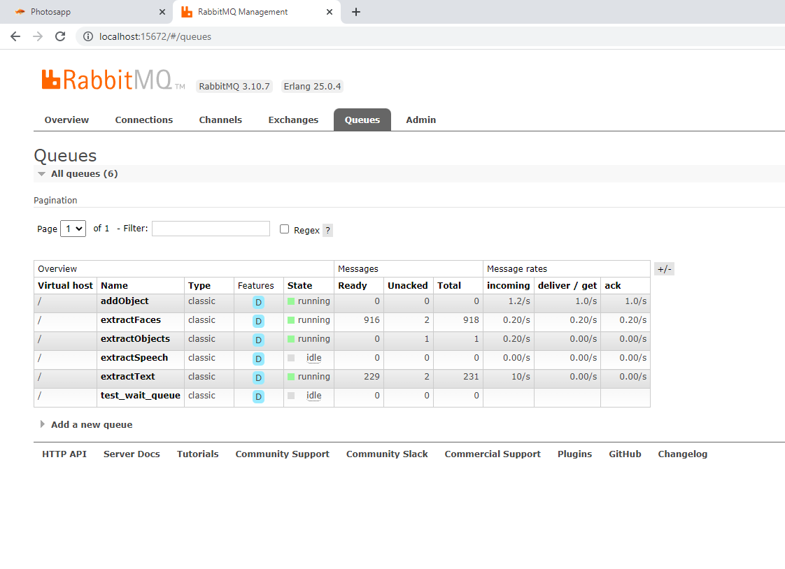

# PhotoAndVideoAnalysis
PhotoAndVideoAnalysis is a system to store and analyze images and video files, the goal is to extract as much information as possible from the images using exif data, image recognition techniques and to provide a web interface to easily use the information extrated to retrieve photo, create albums, etc...

Main technologies used are docker, postgres, rabbitmq, ffmpeg, mongodb, opencv, nginx
Programming languages are Python and Javascript (Angular)

[]

# Working principles
1. original file is never modified (batch load will move from load folder to storage folder keeping the same directory hierarchy)
2. analysis are queued per analysis type using Rabbitmq

# Load in DB
Batch load from a source folder
1. prevent duplicate photo or video insertion using sha 512
2. extract exif from photo or video (camera type, gps data, date and time)
3. thumbnail creation

# Analysis
## Photos:
1. object detection
2. face detection
3. text detection and OCR

## Video:
1. speech to text

# Web Interface:
1. Drag and drop image to upload to db and run thru analyses
2. search criteria using date, gps coordinates (thru map area selection and also files with no gps coordinates), object detected, face similarity, camera type, file format
[]
3. open street map pins for each photo video with GPS coordinate
[]
[]
[]
4. add comments to video or photo in db
5. add gps coordinates to video or photo in db
6. group photos or videos in albums
7. stats for photos and videos
[]
9. layer on top of picture to highlight detected objects
[]
11. Find similar faces across the database
[]
